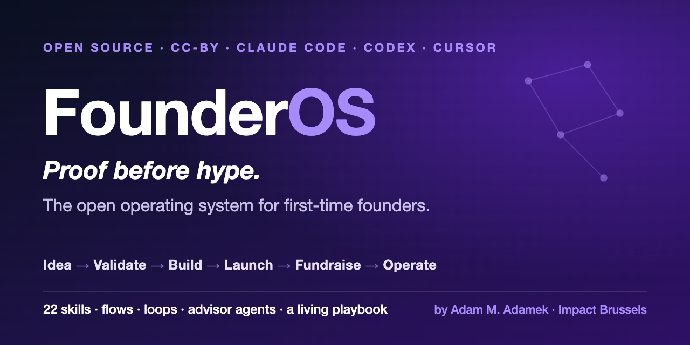

<div align="center">



# FounderOS

### The open operating system for first-time founders.

#### *Proof before hype. The operating system I wish I'd had.*

*Startup knowledge is fragmented, gatekept, and sold as $5k courses. FounderOS is the whole
operating system - open, free, attribution-only - so a first-time founder with an AI co-pilot
is never lost about what to do next.*

[Skills](#the-skills) · [Quickstart](#quickstart) · [The journey](#the-founder-journey) ·
[Non-coders start here](#no-code-just-prompts) · [Contribute](#contribute) · [Sponsor](#sponsor)

    

</div>

---

## Why this exists

For 25 years I worked in food and biotech R&D - the kind of science where a confident guess
that skips the evidence costs millions. Then I did what I'd spent a career helping others do:
I started building. I taught myself to work with AI - Python, training models, shipping in the
open - as a genuine first-time founder.

I hit the wall every first-timer hits: not *how* to do a thing, but *which* thing to do next -
validate or build? launch or raise? - and how to tell a real signal from hype. The advice
existed, scattered across books, threads, and $5k courses, none of it wired into the tools I
actually built in.

So I built the operating system I wish I'd had: the founder journey, encoded as runnable AI
skills, carrying the one rule I brought from the lab - **proof before hype.** Validate before
you build. Cite before you claim. A draft is never a decision.

**FounderOS** turns "I have an idea" into a sequence of clear, testable next steps - on Claude
Code, Codex, Cursor, or just pasted into a chatbot. It is **theme-agnostic** on purpose:
software, soap, or services, you supply the domain and FounderOS supplies the method. And it's
**open**, because I'm on a mission to make entrepreneurship something anyone can start - not a
club you pay to enter.

- *Adam M. Adamek, PhD · [Impact Brussels ASBL](https://impact.brussels) · building in the open*
Read the [MANIFESTO](MANIFESTO.md) · meet the author and [why I write](AUTHOR.md).

> *"Proof before hype" isn't a slogan I picked - it's the title of my book on how food-innovation
> founders turn scientific promise into trust, trial, and traction. FounderOS is that same
> discipline, made runnable. → [Books by the author](AUTHOR.md#why-i-write)*

## The founder journey

FounderOS is organised the way a founder actually moves:

```
 Idea & Validation  →  Build / MVP  →  Launch & GTM  →  Fundraise  →  Operate & Scale
```

Not sure where you are? **Run `start-here`** - it asks three questions and routes you to the
one skill to run next. Full map: [docs/STAGES.md](docs/STAGES.md) ·
One-page printable: [docs/CHEATSHEET.md](docs/CHEATSHEET.md).

## The skills

22 deep, end-to-end skills (v0.1.0). Each produces a real artifact and ends with a copy-paste
prompt for non-coders.

| Stage | Skills |
|-------|--------|
| **Idea & Validation** | `validate-idea` · `customer-interviews` · `cofounder-and-equity` |
| **Build / MVP** | `scope-mvp` · `north-star-metrics` · `consumer-product-testing` · `sensory-testing` |
| **Launch & GTM** | `positioning-and-gtm` · `launch-plan` · `find-first-customers` · `pricing-strategy` · `landing-page-copy` · `brand-and-naming` |
| **Fundraise** | `pitch-deck` · `investor-pipeline` |
| **Operate & Scale** | `runway-and-unit-economics` · `legal-and-incorporation` · `first-hire` |
| **Cross-cutting** | `start-here` · `apply-mental-models` · `capture-learning` · `founderos-prompt-scaffold` |

Plus **3 flows** (multi-step workflows: `/validate-idea-flow`, `/launch-flow`,
`/fundraise-flow`), **3 loops** (recurring cadences: daily standup, weekly metrics review,
investor update), and **3 advisor agents** (`founder-coach`, `skeptical-investor`,
`customer-proxy`).

This is the beginning. The [SKILLS-ROADMAP](SKILLS-ROADMAP.md) maps ~85 more - each a
ready-made contribution slot.

## How it works

- **Skills** - one founder job each, built on a shared [prompt scaffold](templates/prompt-scaffold.md) so the whole OS feels like one tool.
- **Flows** - chain skills with checkpoints, so you review before you commit.
- **Loops** - the rhythm of running a startup, scheduled.
- **Advisor agents** - dispatch a lens (a skeptical investor, a target customer) on demand.
- **A living knowledge base** - FounderOS gets smarter as you use it: the [`capture-learning`](skills/capture-learning/SKILL.md) skill records real outcomes into [`knowledge-base/`](knowledge-base/) so it stops repeating mistakes.

## Quickstart

**Claude Code** - clone into your skills path (or add as a plugin):
```bash
git clone https://github.com/impactbrussels/FounderOS.git
cd FounderOS && ./install.sh        # see install.sh for what it does
```
Then, in Claude Code: *"Use start-here - I have a startup idea."*

**New to it? Read the [Getting Started / Usage guide](docs/USAGE.md)** - it shows exactly how to
run every skill, flow, loop, and advisor agent on each platform. The short version: when in
doubt, run `start-here` and it tells you what to do next.

**Not technical? No problem.** Read [FounderOS for non-technical founders](docs/FOR-NON-TECHNICAL-FOUNDERS.md) - copy-paste prompts, zero setup.

**Codex / Cursor** - the same `skills/` source works; Codex reads [AGENTS.md](AGENTS.md),
Cursor reads [.cursor/rules/founderos.mdc](.cursor/rules/founderos.mdc). See the
[cross-platform guide](docs/cross-platform-guide.md).

## No code? Just prompts.

You do not need any developer tools. Every skill has a **copy-paste prompt** at the bottom of
its file. Open the [Prompt Library](prompts/README.md), pick your stage, copy the block, paste
it into Claude.ai / ChatGPT / Gemini, fill the `[PLACEHOLDERS]`, and iterate.

New here? Watch one fictional startup walk the entire journey - including a failed test that
forces a pivot - in [examples/sample-startup.md](examples/sample-startup.md).

## Lost on a term?

The [founder glossary](docs/GLOSSARY.md) plain-explains ~44 of the words first-timers trip on
(CAC, runway, SAFE, dilution, vesting, north-star metric…).

## Contribute

FounderOS is built to be built *with* you. The [roadmap](SKILLS-ROADMAP.md) lists ~85 planned
skills, each tagged 🟢 *good first issue* / 🟡 *help wanted* / 🔵 *design needed*. Claim one,
copy the gold-standard [`validate-idea`](skills/validate-idea/) skill, and open a PR. Start with
[CONTRIBUTING.md](CONTRIBUTING.md).

## Sponsor

FounderOS is free and attribution-only. Sponsorship keeps it growing and independent - see
[SPONSORS.md](SPONSORS.md) and [.github/FUNDING.yml](.github/FUNDING.yml). If your company sells
to founders, sponsoring puts you in front of them at the exact moment they're making decisions.

## License & attribution

Dual-licensed so credit is **legally required**:
- **Content** (skills, prompts, docs, templates) - [CC-BY-4.0](LICENSE-CONTENT).
- **Code** (scripts, workflows) - [Apache-2.0](LICENSE-CODE).

Attribution: **FounderOS by Adam M. Adamek (Impact Brussels ASBL)**. Details:
[ATTRIBUTION.md](ATTRIBUTION.md). Citing in research? See [CITATION.cff](CITATION.cff).

<div align="center">

**FounderOS** · made for founders, by a founder · [Impact Brussels ASBL](https://impact.brussels)

</div>
